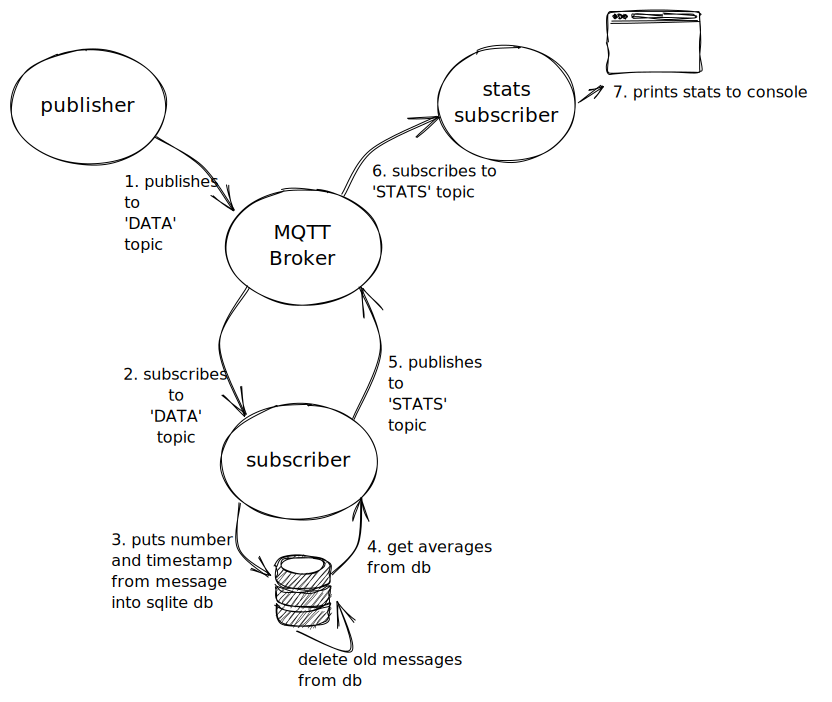

# mqtt-exercise-python

## How to run app
### To run locally
(requirements: localhost needs `docker` and `docker-compose (v1)` to be installed and running)
**N.B:** if you have `docker compose (v2)` installed instead, follow step 2 in [the section on running app on ec2](#to-run-on-ec2-instance) instead

1. clone repo
```
git clone https://github.com/hqtan/mqtt-exercise-python.git`
cd mqtt-exercise-python
```
2. run `docker-compose` to see the calculated averages
**N.B:**
* the first run may take a while, as it pulls and builds the docker images
```
docker-compose up --build
```
console out should look something like this:
```
stats_subscriber    |   avg_1min    avg_5min    avg_30min
stats_subscriber    | ----------  ----------  -----------
stats_subscriber    |         46        45.7      47.1778
stats_subscriber    |   avg_1min    avg_5min    avg_30min
stats_subscriber    | ----------  ----------  -----------
stats_subscriber    |         56          49      48.2391
stats_subscriber    |   avg_1min    avg_5min    avg_30min
stats_subscriber    | ----------  ----------  -----------
stats_subscriber    |       60.4     50.6667           49
...
```

to run app in 'verbose' mode (to see the console output of `mosquitto`, `publisher` and `subscriber` container), run this command:
```
docker-compose -f docker-compose-debug.yml up --build
```

### To run on EC2 instance
1. [ssh to ec2 instance](https://lightsail.aws.amazon.com/ls/docs/en_us/articles/amazon-lightsail-ssh-using-terminal)
2. `docker` and `docker-compose` has already been installed, and the repo has already been cloned. `cd` to repo and run `docker compose`
```
docker compose up --build --attach stats_subscriber
```

to run app in 'verbose' mode (to see the console output of `mosquitto`, `publisher` and `subscriber` container), run this command:
```
docker compose up --build
```

## Systems diagram



### Design assumptions
* all published messages must be received by subscriber(s), ie: no dropped messages
* no auth and TLS used: publisher and subscriber running in secure environment
* timestamp not timezone sensitive (in UTC time)
* messages can be stored in sqlite db
* all the processes can be containerised

## Design decisions
* All processes are containerised. They are separated into 4 containers:
  * `mosquitto` (broker) - runs the mosquitto mqtt broker
  * `publisher` - runs the `publish.py` python process. Publishes a number between 1-100 at random intervals between 1-30 seconds to 'DATA' topic
  * `subscriber` - runs the `subscribe.py` python process. It does a number of things:
    * subscribes to 'DATA' topic
    * creates a `messages` db table (if it doesn't exist), and inserts messages from 'DATA' topic into table
    * cleans messages from table that are older than 35 minutes
    * gets the calculated averages from table, and publishes it to 'STATS' topic
  * `stats_subscriber` - runs the `stats_pubsub.py` python process. It subscribes from the 'STATS' topic, and prints the averages in a tabular layout to console.
* containers are 'orchestrated' using `docker compose`. Start order is:
  1. `mosquitto` container starts up first
  2. `subscriber` container starts next, and connects to broker, subscribed to 'DATA' topic
  3. `stats_subscriber` container starts next, and connects to broker, subscribed to 'STATS' topic
  4. finally the `publisher` container starts, when the broker and subscriber processes are up.
* the random numbers and associated timestamps (in epoch seconds) published on 'DATA' topic are stored in a sqlite3 db.
  * only the last 35 minutes of data are kept. The rest are deleted. This 'cleaning' process is done in the `subscriber` process' `on_message` callback.
* Averages calculated using SQL `AVG` function, and then published by `subscriber` container to 'STATS' topic. The stats are not saved into sqlite db.
* `.env` for environment variables used by python processes. The environment variables used are:
  * `BROKER` - the hostname for MQTT broker. Defaults to `localhost`. In the docker containers, this has been set to `mosquitto` (the name of container running the mosquitto service)
  * `DB_FILE` - the name of the file containing the sqlite db. Defaults to `tmp/test.db`
  * `STATS_TOPIC` - the name of the topic containing the stats
  * `TOPIC` - the name of the topic containing the data